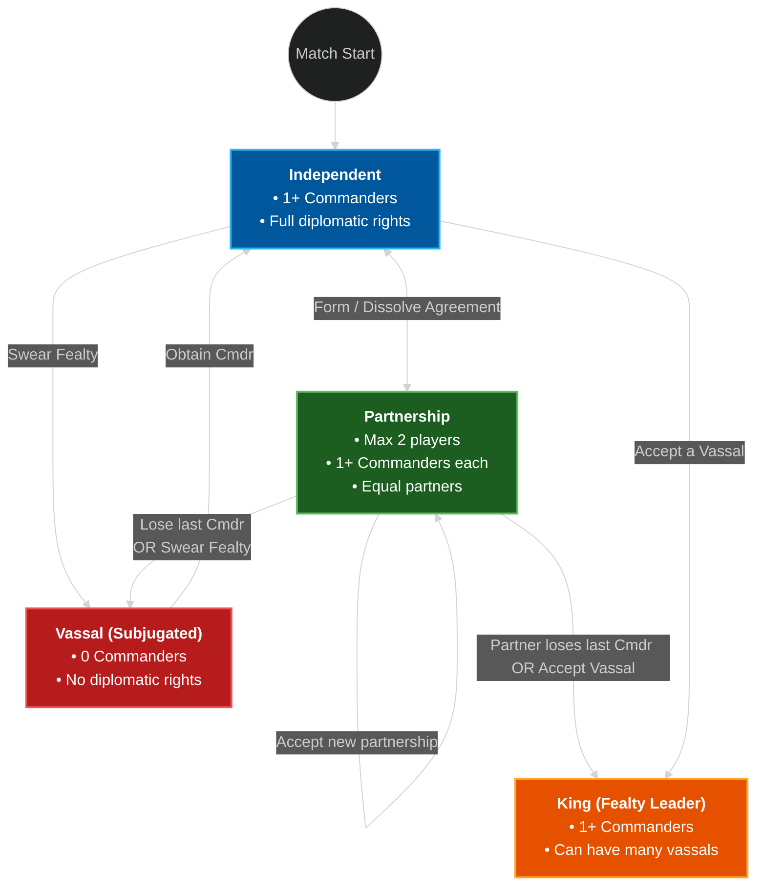

Summary of State Behavior
Independent: Can form Partnerships or swear Fealty.

Summary of State Behavior
Independent: Can form Partnerships or swear Fealty.

Partnership: Two equal players. If one loses their Commander, the partnership instantly collapses into a Fealty relationship where the survivor becomes the King and the fallen player becomes the Vassal.

Vassal: Trapped with 0 commanders and locked out of diplomacy

King: Can have many vassals

If you aren't a vassal and lose your last commander you are out of the game.

If a King loses their last commander the King and all of their vassals are out of the game.
